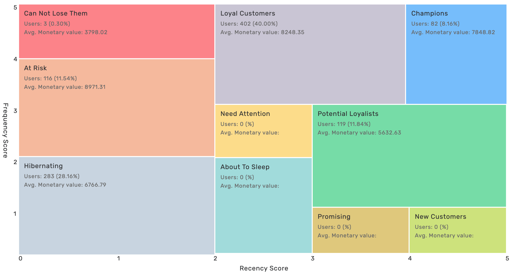

# Customer Lifetime Value Prediction Model using Machine Learning

This project models Customer Lifetime Value using both probabilistic and machine learning techniques on the Online Retail dataset.

## Dataset

- Source: [Kaggle - Online Retail Dataset](https://www.kaggle.com/datasets/vijayuv/onlineretail)
- Records from Dec 2010 - Dec 2011
- Transactional data including InvoiceDate, Quantity, CustomerID, UnitPrice, etc.

## Objective

Estimate future transaction behavior of customers and segment them for effective targeting.

## Methodologies

### 1. Probabilistic Modeling

- **BG/NBD Model** to predict purchase frequency
- **Gamma-Gamma Model** to estimate monetary value

### 2. Machine Learning

- **XGBoost Regressor** trained on engineered features:
  - `latetime`, `earlytime`, `freq`, `freq_3m`

## Results

| Model             | RMSE   | R²     |
|------------------|--------|--------|
| BG/NBD + Gamma   | 1.6298 | 0.5610 |
| XGBoost          | 0.9432 | 0.8530 |

## Visualizations

- Distribution plots for Poisson, Gamma, Beta, and Geometric models
- RFM Segmentation Heatmap:

## 📢 Recommendations

| Segment           | Strategy                                        |
|-------------------|-------------------------------------------------|
| Champions         | Loyalty rewards, early access campaigns         |
| At Risk           | Win-back discounts, surveys                     |
| Loyal             | Cross-sell, feedback collection                 |
| Hibernating       | Re-engagement emails                            |

## Tech Stack

- Python (Pandas, NumPy, Scikit-learn, Lifetimes, XGBoost)
- Jupyter Notebook
- Matplotlib / Seaborn for visualization

## File Structure

- `Customer Lifetime Value Modeling.ipynb`: Main notebook
- `OnlineRetail.csv`: Dataset
- `Image#X.png`: Supporting visuals
- `Project Report CLV Prediction Model using Machine Learning .pdf` : Project Report

---

## Acknowledgments

Inspired by customer segmentation techniques in retail and CLV modeling using probabilistic models (BG/NBD, Gamma-Gamma) and XGBoost.

## 🔗 Connect With Me

- GitHub: [YourGitHubUsername](https://github.com/AkashKumarRajak) 
- LinkedIn: [YourLinkedInProfile](https://www.linkedin.com/in/akash-kumar-rajak-22a98623b/) 
- Email: akashkumarrajak200@gmail.com 

